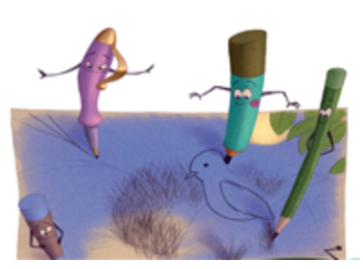

Choose the best answer based on "Super Tools."

# Question 1.
```
The story takes place ____.
```

- A. at Lucy's friend's house
- B. in Lucy's backpack
- C. in Lucy's house
- D. at Lucy's school

<details>
<summary>float</summary>

C
</details>

# Question 2.
```
What is the problem in the story?
```

- A. Lucy's writing tools are angry with one other.
- B. Lucy stops using her writing tools.
- C. Lucy breaks her computer.
- D. Lucy get in trouble.

<details>
<summary>float</summary>

B
</details>

# Question 3.
```
Why does Lucy stop using her writing tools?
```

- A. She does not like them.
- B. Her parent will not let her use them.
- C. She gets a new computer.
- D. She has too much homework to do.

<details>
<summary>float</summary>

C
</details>

# Question 4.
```
Part A. Lucy writing tools feel ____
when Lucy gets a new computer.
```

- A. sad and useless
- B. excited and happy
- C. happy and useful
- D. sick and unhappy

<details>
<summary>float</summary>

A
</details>

# Question 5.
```
Part B. Choose TWO pictures that support
the answer to Question 4: Lucy's writing
tools feel sad and useless when Lucy
gets a new computer.
```

- A. 
- B. 
- C. 
- D. 

<details>
<summary>float</summary>

A  
C
</details>

# Question 6.
```
Why do the writing tools draw a picture for Lucy?
```

- A. to stop her from using them
- B. to remind her how great they are
- C. to make her angry
- D. to remind her that her computer is better

<details>
<summary>float</summary>

B
</details>

# Question 7.
```
Lucy prints a picture of birds from her computer.
```

- A. True
- B. False

<details>
<summary>float</summary>

B
</details>

# Question 8.
```
Find the sentence that shows Lucy is surprised.
```

- A. Lucy woke up late.
- B. She had to write a report about birds.
- C. She couldn't believe her eyes!
- D. But not everyone was happy about the new computer.

<details>
<summary>float</summary>

C
</details>

# Question 9.
```
What is the theme of the story?
```

- A. Drawing a picture is better than writing a report.
- B. Computers are easier to use then pens and pencils.
- C. Pencils and pens are useless and should not be used.
- D. Chracters can work together to make their lives better.

<details>
<summary>float</summary>

D
</details>

# Question 10.
```
"Super Tools" is ____.
```

- A. an informational text
- B. a biography
- C. a fantasy
- D. a narrative nonfiction story

<details>
<summary>float</summary>

C
</details>