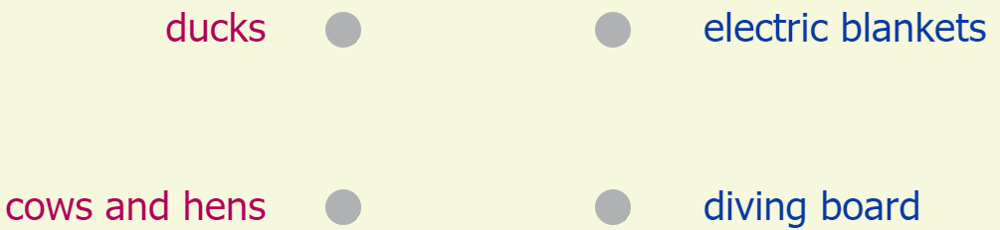

Choose the best answer based on "Click, Clack, Moo: Cows That Type"

#### Question 1.
Find the sentence from "Click, Clack, Moo: Cows That Type" that shows that Farmer Brown is surprised.

- A. Farmer Brown has a problem.
- B. His cows like to type.
- C. At first, he couldn't believe his ears.
- D. Click, clack, moo.

float

C

#### Question 2.
Draw lines to match the animals to what they want in "Click, Clack, Moo: Cows That Type."

float

1 - B  
2 - A

#### Question 3.
How are Farmer Brown's cows special?

- A. They can talk out loud.
- B. They can type on the typewriter.
- C. They can make milk.
- D. They live in a barn.

float

B

#### Question 4.
What causes the cows to go on strike?

- A. Farmer Brown throws the cows' typewriter in the trash.
- B. Farmer Brown does not give the cows blanket.
- C. Farmer Brown does not feed the cows.
- D. Farmer Brown throws the cows out of the barn.

float

B

#### Question 5.
Find the correct answer to complete the sentence based on "Click, Clack, Moo: Cows That Type."

##### Farmer Brown is ____ when the cows and hens go on strike.

- A. lazy
- B. funny
- C. brave
- D. angry

float

D

#### Question 6.
What do the ducks do with the typewriter?

- A. They take it to Farmer Brown.
- B. They break it.
- C. They keep it.
- D. They give it back to the cows.

float

C

#### Question 7.
How are the cows and ducks the same?

- A. They dislike Farmer Brown.
- B. They want something from Farmer Brown.
- C. They want to leave Farmer Brown's farm.
- D. They live in the pond.

float

B

#### Question 8.
Why is Farmer Brown angry when the cows and hens go on strike?

- A. Because he needs them to do his chores.
- B. Because he needs milk and eggs to run his farm.
- C. Because he needs them to take care of the farm for him.
- D. Because he needs milk and eggs to give to his friends.

float

B

#### Question 9.
Answer in the correct order based on "Click, Clack, Moo: Cows That Type"

- A. The cows and hens go on strike.
- B. The ducks keep the typewriter and ask for a diving board.
- C. The cows ask Farmer Brown for electric blankets.
- D. Farmer Brown trades the typewriter for electric bankets.

float

C  
A  
D  
B

#### Question 10.
"Click, Clack, Moo: Cows That Type" is a fantasy story because ____.

- A. it gives fact about real places and things
- B. the characters and animals seem real
- C. the animals act like real people
- D. it gives information about a real person

float

C

