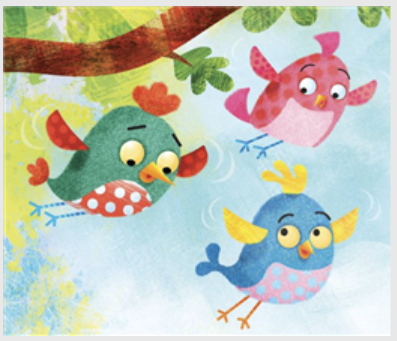
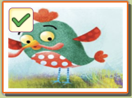
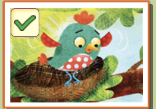
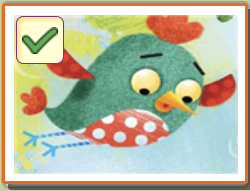
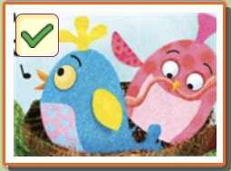

Choose the best answer based on "Little Flap Learns to Fly."

#### Question 1.
```
Find the TWO sentences that tell you where the three birds live in "Little Flap Learns to Fly."
```

- A. Little Flap was happy living in his nest.
- B. His friends, Fluff and Tuff, lived in the next next to him.
- C. Every morning they sang songs together.
- D. Their parents brought them worm to eat.
- E. One day Fluff asked, "Can we get our own worms?"

<details>
<summary>float</summary>

A, B
</details>

#### Question 2.
Choose the answer to complete the sentence about "Little Flag Learns to Fly."

```
Tuff, Fluff and Little Flap will be able to ____ if they learn to fly.
```

- A. sing beautifully
- B. get their own worms
- C. grow colorful feathers
- D. make stronger nests

<details>
<summary>float</summary>

B
</details>

#### Question 3.
Choose the best answer based on "Little Flap Learns to Fly."
```
Part A. What is the main problem in the story?
```

- A. Little Flap is nervous about jumping from his nest.
- B. Little Flap cannot find his mom.
- C. Little Flap does not know how to make a nest.
- D. Little Flat cannot find any worms.

<details>
<summary>float</summary>

A
</details>

#### Question 4.
Choose the best answer based on "Little Flap Learns to Fly."
```
Part B. Find the sentence that supports the answer to Question 3: Little Flap is nervous about jumping from his nest.
```

- A. Tuff and Little Flap watched Fluff. Then they copied her actions.
- B. Little Flap said, "Now I know I can always depend on you, Fluff and Tuff! You are my friends."
- C. Eveny morning they sang songs together. Their parents brought them worms to eat. One day Fluff asked, "Can we get our worms?"
- D. Little Flap peered over the edge of his nest. It was very high up. When he looked down, the ground seemed very far away. He felt scared!

<details>
<summary>float</summary>

D
</details>

#### Question 5.
Find the detail from "Little Flap Learns to Fly" that shows Little Flap likes his friends.

```
Then he found a big, juicy worm and shared it with his friends. Now Little Flap likes flying!
```

- A. Then he found a big,
- B. juicy worm and
- C. shared it with his friends.
- D. Now Little Flap likes flying!

<details>
<summary>float</summary>

C
</details>

#### Question 6.
```
Choose the answer that describes the picture from "Little Flap Learns to Fly."
```


- A. The three friends flap their wings and jump.
- B. The three friends sing together.
- C. Little Flap finds a worm on the ground.
- D. Little Flap's parents teach Little Flap how to fly.

<details>
<summary>float</summary>

A
</details>

#### Question 7.
```
Write the alphabet of pictures in the correct order based on "Little Flap Learns to Fly."
```

- A. 
- B. 
- C. 
- D. 

<details>
<summary>float</summary>

D B C A
</details>

#### Question 8.
Find TWO the answers to complete the sentence based on "Little Flap Learns to Fly."
```
Fluff and Tuff are ____ friends because Little Flap can ____ on them.
```

- A. depend
- B. jump
- C. angry
- D. helpful

<details>
<summary>float</summary>


</details>

#### Question 9.
Choose the best answer based on "Little Flap Learns to Fly."
```
What is the stroy mostly about?
```

- A. three friends who learn how to fly
- B. three friends who look for their parents
- C. a family of birds that sing a song
- D. a family of birds that build a nest

<details>
<summary>float</summary>

A
</details>

#### Question 10.
Choose the best answer based on "Little Flap Learns to Fly."
```
What is the genre of the stroy?
```

- A. nonfiction
- B. realistic fiction
- C. fantasy
- D. poetry

<details>
<summary>float</summary>

C
</details>