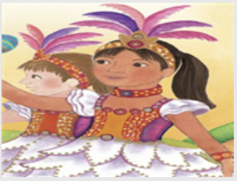

Choose the best answer based on "Maria Celebrates Brazil."

#### Question 1.
Choose the best answer to complete the sentence based on "Maria Celebrates Brazil."

```
The language most people speak in Brazil is ____.
```

- A. English
- B. Portuguese
- C. Brazilian
- D. Spanish

<details>
<summary>float</summary>

B
</details>

#### Question 2.
Choose the main character from "Maria Celebrates Brazil."

- A. Mãe
- B. Pai
- C. Maria
- D. Ana

<details>
<summary>float</summary>

C
</details>

#### Question 3.

```
What is the main problem in the story?
```

- A. Maria is the new kid in school.
- B. Maria does not know to march in a parade.
- C. Maria does not understand English.
- D. Maria wants to go to a friend's house and not practice.

<details>
<summary>float</summary>

D
</details>

#### Question 4.
Find the languages Maria speaks from "Maria Celebrates Brazil."

- A. Spanish
- B. French
- C. Portuguese
- D. English

<details>
<summary>float</summary>

C, D
</details>

#### Question 5.
Write the events in the correct order based on "Maria Celebrates Brazil."

- A. Maria agrees with her parents and goes to dance practice.
- B. Maria begs to go to Ana's house.
- C. Maria gets her picture taken in the parade.
- D. Maria's dad tells her that she will get her costume at practice.

<details>
<summary>float</summary>

B -> D -> A -> C
</details>

#### Question 6.
Which is an example of sharing your culture with others?

- A. reading a realistic fictional story in your bed at night
- B. watching a parade on TV
- C. taking pictures of people on the street
- D. sharing your country's food at a parade

<details>
<summary>float</summary>

D
</details>

#### Question 7.
Which is closet in meaning to the underlined expression in the following sentence from the stroy?<br>
"Maria <U>smiles from ear to ear.</U>"

- A. Maria's ears look happy.
- B. Maria's smile is big.
- C. Maria covers her ears while she smiles.
- D. Maria's smile is small.

<details>
<summary>float</summary>

B
</details>

#### Question 8.


```
What is Maria wearing in the picture?
```

- A. her school uniform
- B. a wedding dress
- C. a Brazilian costume
- D. a Halloween costume

<details>
<summary>float</summary>

C
</details>

#### Question 9.
Choose all right words those the ways Maria shares her culture from "Maria Celebrates Brazil."

- A. makes food
- B. dances
- C. sings songs
- D. wears clothes

<details>
<summary>float</summary>

B, D
</details>

#### Question 10.
Choose the different settings from "Maria Celebrates Brazil."

- A. Maria's kitchen
- B. Ana's house
- C. Maria's school
- D. on the street

<details>
<summary>float</summary>

A, D
</details>
