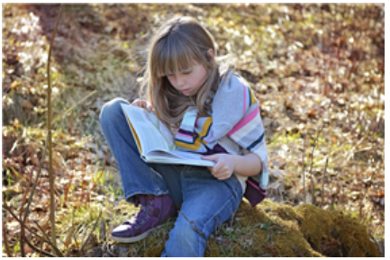
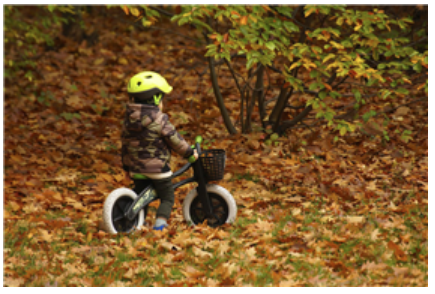
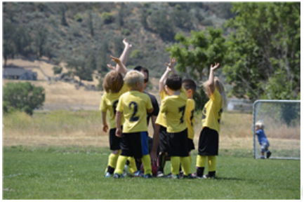
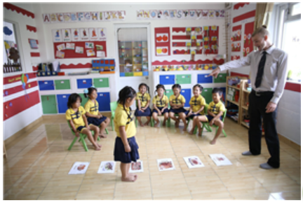
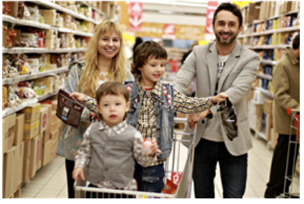
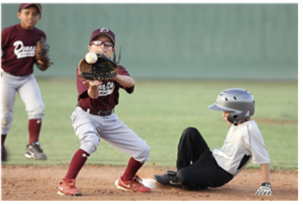

#### Question 1.
Which shows people doing something as a group?

- A. 
- B. 
- C. 
- D. 

<details>
<summary>float</summary>

D
</details>

#### Question 2.
How can you cooperate AFTER you are done eating a meal?

- A. clean up
- B. set the table
- C. cook

<details>
<summary>float</summary>

A
</details>

#### Question 3.
Based on the next, which shows classmates cooperating in school?

- A. 
- B. 
- C. 
- D. 

<details>
<summary>float</summary>

B
</details>

#### Question 4.
Which would you NOT share with everyone in your community?

- A. the roads in your neighborhood
- B. the park where you play
- C. the stores in your neighborhood
- D. the house where you live

<details>
<summary>float</summary>

D
</details>

#### Question 5.
How can people in a community cooperate to make the place they live beautiful?

- A. They can share a meal.
- B. They can play games together.
- C. They can clean up a messy park.
- D. They can have a bake sale.

<details>
<summary>float</summary>

C
</details>

#### Question 6.
Read the sentence carefully. Then choose the best word to complete the sentence.

```
Our ____ of friends plays soccer on a team.
```

- A. share
- B. together
- C. cooperate
- D. group

<details>
<summary>float</summary>

D
</details>

#### Question 7.
Read the sentence carefully. Then choose the best word to complete the sentence.

```
Eric is the name of my new ____ at school.
```

- A. cooperate
- B. classmate
- C. community
- D. share

<details>
<summary>float</summary>

B
</details>

#### Question 8.
Read the sentence carefully. Then choose the best word to complete the sentence.

```
Amy and I sit ____ during lunch.
```

- A. together
- B. community
- C. group
- D. cooperate

<details>
<summary>float</summary>

A
</details>

#### Question 9.
Read the sentence carefully. Then choose the correct meaning of the underlined word.<br><br>

Mary and her sister <U>share</U> a bedroom.

- A. a student in the same class as you at school
- B. to work together with others toward a goal
- C. to use or have something with others
- D. people or things that are together or connected

<details>
<summary>float</summary>

C
</details>

#### Question 10.
Read the sentence carefully. Then choose the correct meaning of the underlined word.<br><br>

My family is a part of a large __community__ in the city.

- A. people or things that are together or connected
- B. a group of people who live or work in the same area
- C. with another person or other people
- D. a student in the same class as you at school

<details>
<summary>float</summary>

B
</details>

#### Question 11.
Read the sentence carefully. Then choose the correct meaning of the underlined word.<br><br>

Tom <U>cooperated</U> with his parents by helping them cook.

- A. to use or have something with others
- B. people or things that are together or connected
- C. with another person or other people
- D. to work together with others towrad a goal

<details>
<summary>float</summary>

D
</details>