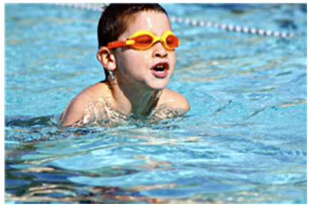
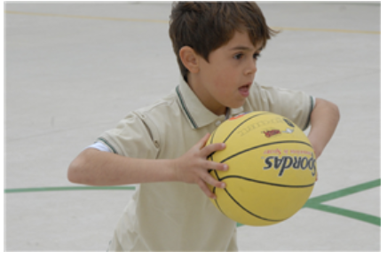
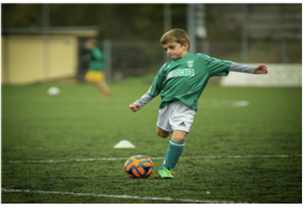
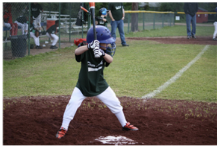
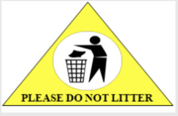

#### Question 1.
Read the questions carefully. Then chose the correct answer.

```
Which of the following is NOT true of rules?
```

- A. Rules help people get along.
- B. Rules make it harder to cooperate.
- C. Rules help to keep people safe.
- D. Rules tell people what to do and what not to do.

<details>
<summary>float</summary>

B
</details>

#### Question 2.
Read the questions carefully. Then chose the correct answer.

```
Which rule helps you understance what NOT to do?
```

- A. Wait in line here.
- B. Please be quiet.
- C. No running.

<details>
<summary>float</summary>

C
</details>

#### Question 3.
Read the questions carefully. Then chose the correct answer.

```
In which sport do batters wear helmets to stay safe?
```

- A. 
- B. 
- C. 
- D. 

<details>
<summary>float</summary>

D
</details>

#### Question 4.
Read the questions carefully. Then choose the correct answer.



```
Which should you NOT do if you see the sign above?
```

- A. Turn your phone on.
- B. Run in the hallways.
- C. Throw trash on the ground.
- D. Drive a car fast.

<details>
<summary>float</summary>

C
</details>

#### Question 5.
Read the questions carefully. Then choose the correct answer.

```
Based on the next, which is a rule you should follow at home?
```

- A. Clean up after dinner.
- B. Listen to your teacher.
- C. Line up for the bus.
- D. Sit quietly at your desk.

<details>
<summary>float</summary>

A
</details>

#### Question 6.
Read the sentence carefully. Then choose the best word to complete the sentence.

```
I follow the ____ by raising my hand in class.
```

- A. chores
- B. fairly
- C. rules
- D. safe

<details>
<summary>float</summary>

C
</details>

#### Question 7.
Read the sentence carefully. Then choose the best word to complete the sentence.

```
The bird cannot fly because its wing ____.
```

- A. fairly
- B. hurts
- C. chore
- D. decides

<details>
<summary>float</summary>

B
</details>

#### Question 8.
Read the sentence carefully. Then choose the best word to complete the sentence.

```
The walls of the castle keep the king ____.
```

- A. safe
- B. rule
- C. fairly
- D. chore

<details>
<summary>float</summary>

A
</details>

#### Question 9.
Read the sentence carefully. Then choose the correct meaning of the underlined word.

```
We <U>decided</U> to play soccer after school.
```

- A. to cause pain or injury
- B. a small job that is done regularly
- C. to think and make a choice about something
- D. something that tells you what you can or cannot do

<details>
<summary>float</summary>

C
</details>

#### Question 10.
Read the sentence carefully. Then choose the correct meaning of the underlined word.

```
Joe and I play <U>fairly</U> by taking turns.
```

- A. something that tells you what you can or cannot do
- B. to cause pain or injury
- C. protected from danger, harm, or loss
- D. in a way that is right and proper

<details>
<summary>float</summary>

D
</details>

#### Question 11.
Read the sentence carefully. Then choose the correct meaning of the underlined word.

```
Amy's last <U>chore</U> is to clean her bedroom.
```

- A. to cause pain or injury
- B. a small job that is done regularly
- C. protected from danger, harm, or loss
- D. something that tells you what you can or cannot do

<details>
<summary>float</summary>

B
</details>