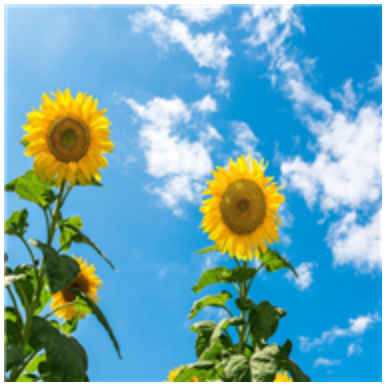
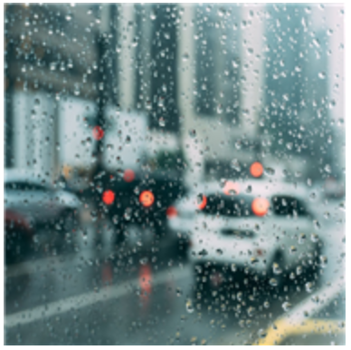
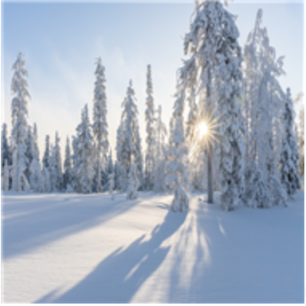
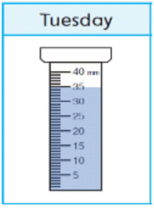
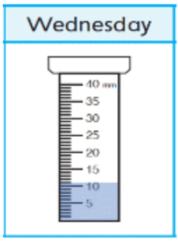
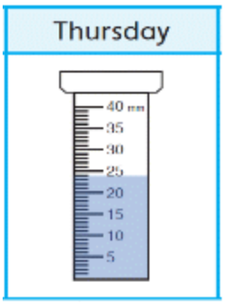
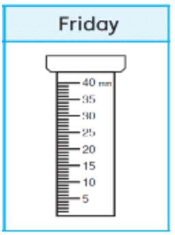

#### Question 1.
```
Which is a picture of snowy weather?
```

- A. 
- B. 
- C. 
- D. 

<details>
<summary>float</summary>

C
</details>

#### Question 2.
Which is a tool that tells you how hot or cold it is outside?

- A. a rain gauge
- B. a thermometer
- C. a windsock
- D. an umbrella

<details>
<summary>float</summary>

B
</details>

#### Question 3.
According to the rain gauges below, which day had the most rain?

- A. 
- B. 
- C. 
- D. 

<details>
<summary>float</summary>

A
</details>

#### Question 4.
What can a windsock tell you?

- A. what the temperature is
- B. how much rain falls
- C. which direction the wind is blowing

<details>
<summary>float</summary>

C
</details>

#### Question 5.
Which is close to the ground when the weather is foggy?

- A. the sun
- B. the moon
- C. the clouds
- D. the stars

<details>
<summary>float</summary>

C
</details>

#### Question 6.
```
The ____ made my clothes and shoes wet.
```

- A. wind
- B. rain
- C. thermometer
- D. temperature

<details>
<summary>float</summary>

B
</details>

#### Question 7.
```
The ____ today is cloudy.
```

- A. thermometer
- B. wind
- C. snow
- D. weather

<details>
<summary>float</summary>

D
</details>

#### Question 8.
I blew on the spoon because the ____ of the soup was too hot.

- A. temperature
- B. thermometer
- C. wind
- D. snow

<details>
<summary>float</summary>

A
</details>

#### Question 9.
The <U>wind</U> pushes the kite higher into the sky.

- A. small, white ice crystals that fall from the sky
- B. air that moves
- C. water that falls from clouds to the ground
- D. what the sky and air outside are like

<details>
<summary>float</summary>

B
</details>

#### Question 10.
According to the <U>thermometer</U>, it is 25 degrees Celsius outside.

- A. water that falls from clouds to the ground
- B. what the sky and air outside are like
- C. a tool that tell you how hot or cold something is
- D. a number that snows how hot or cold something is

<details>
<summary>float</summary>

C
</details>

#### Question 11.
Flakes of <U>snow</U> landed on Charlie's head.

- A. a number that snows how hot or cold something is
- B. what the sky and air outside are like
- C. air that moves
- D. small, white ice crystals that fall from the sky

<details>
<summary>float</summary>

D
</details>