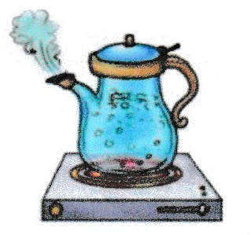

### Choose the picture with same vowel sound as "stew".

 - a. 
 - b. 
 - c. 
 - d. 

 

float

b

### Choose the picture with same vowel sound as "toy".

 - a. 
 - b. 
 - c. 
 - d. 

float

d

### Choose the picture with same vowel sound as "oil".

 - a. 
 - b. 
 - c. 
 - d. 

float

b

### Choose the correct letters to complete the name of each picture.

n__t  

 - a. eo
 - b. eu
 - c. ew
 - d. uo

float

c

f__l  

 - a. oi
 - b. ow
 - c. oy
 - d. ew

float

a

j__  

 - a. oi
 - b. oy
 - c. ew
 - d. ou

float

b

### Write correct name of each picture.

| | | |
|----|----|----|
|  |  |  |

 
 

----------

float

boil

