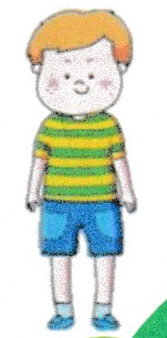
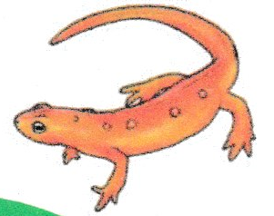
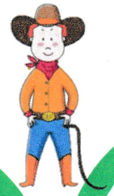
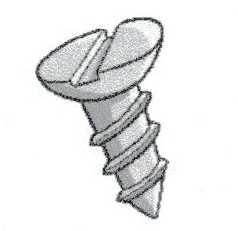
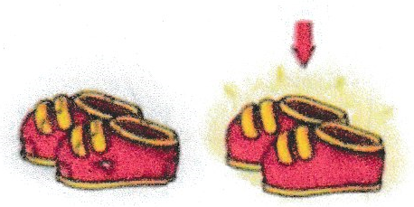
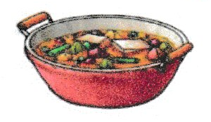
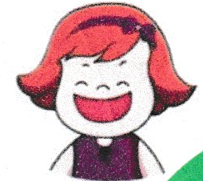
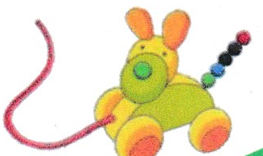
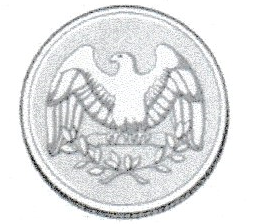

### Choose the picture with same vowel sound as "stew".

 - a. 
 - b. 
 - c. 
 - d. 

### Choose the picture with same vowel sound as "toy".

 - a. 
 - b. 
 - c. 
 - d. 

### Choose the picture with same vowel sound as "oil".

 - a. 
 - b. 
 - c. 
 - d. 

### Choose the correct letters to complete the name of each picture.

1. 

n__t  

 - a. eo
 - b. eu
 - c. ew
 - d. uo

2. 

f__l  

 - a. oi
 - b. ow
 - c. oy
 - d. ew

3. 

j__  

 - a. oi
 - b. oy
 - c. ew
 - d. ou
ss